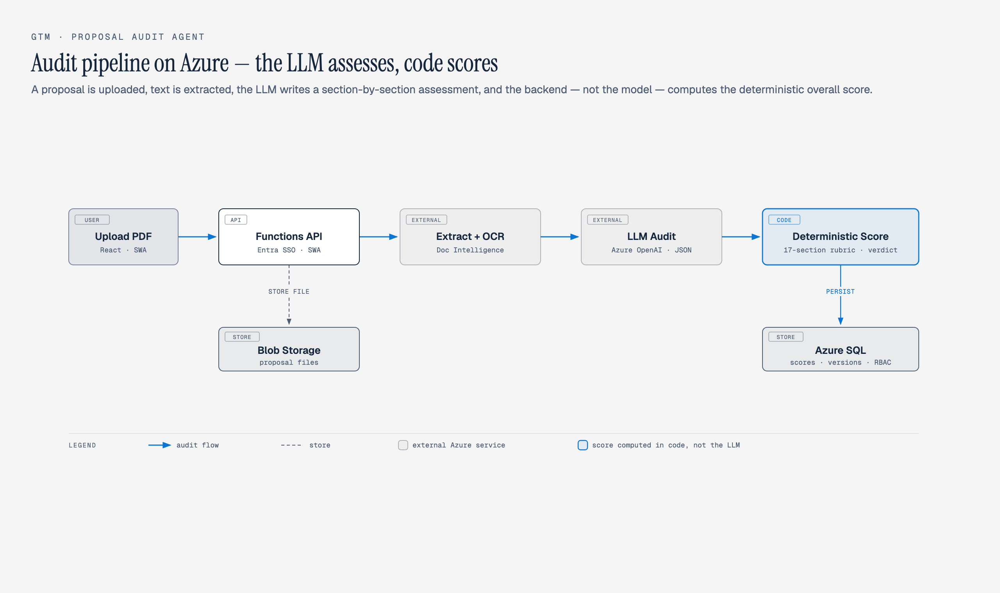
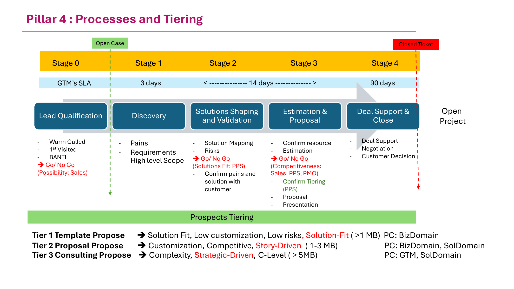
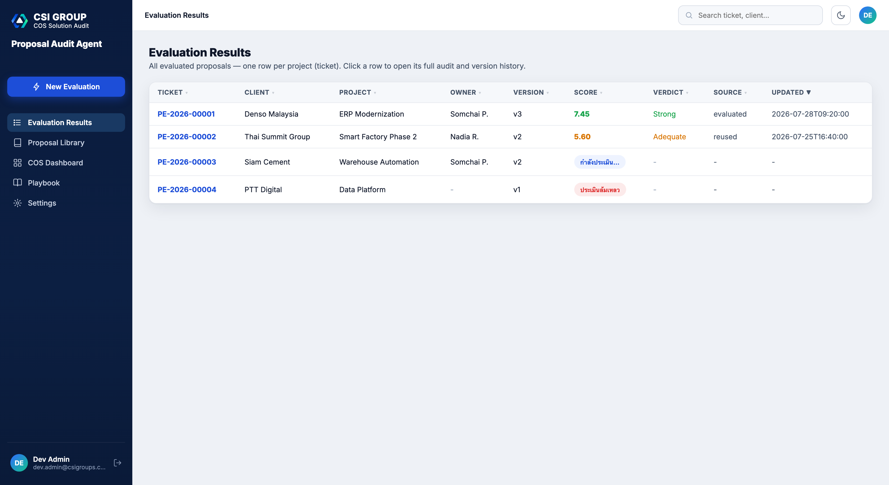
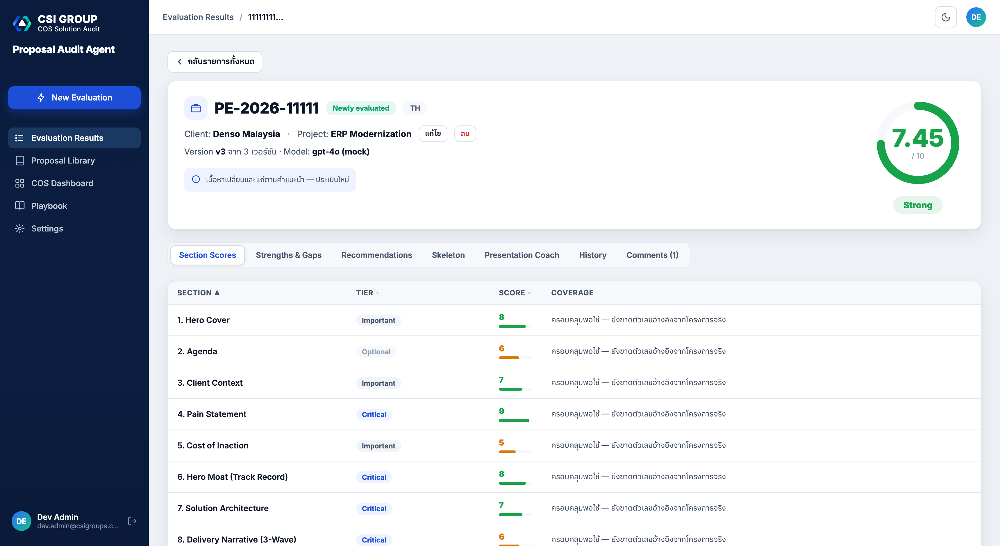
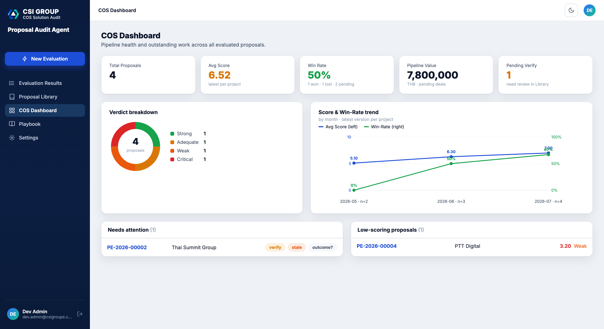

# GTM Proposal Audit Agent

[](https://github.com/rungrojcsi/GTM-Proposal-Audit-Agent/actions/workflows/ci.yml)

A web app that audits B2B proposal quality before it goes to the customer — engineers/sales upload a proposal (PDF only) and the system returns per-section scores, strengths & gaps, recommendations, and a recommended skeleton structure. It ports the logic of the `proposal-master` skill to run on **Azure OpenAI**, entirely on Azure.

> **Status: In production** — deployed on Azure with Entra ID SSO, used by the COS team.
>
> **Internal use only — CSI GROUPS.** Uploaded proposals are real customer documents — they live in private Blob storage and Azure SQL, never in this repo.

## Business End-Users

- **Primary users — Sales Engineers & Sales:** submit each proposal and get an instant, criteria-based audit before it reaches the customer.
- **Moderator & auditor — COS (Corporate Solution Audit):** reviews and verifies results, owns the rubric, and governs proposal quality across the pipeline.

**The shift:** proposal quality moves from *reviewer-by-reviewer judgment* to a *shared, auditable standard* — Sales self-checks, COS governs.



## 1. Pain Points

Problems in the proposal process before this tool existed:

- **Technically strong proposals still lost on narrative** — real audits found decks whose track record was buried in the appendix, with no explicit ask and no differentiation slide; C-level readers never saw why the vendor should win.
- **Quality depended on the author** — there was no shared, measurable standard of what a strong proposal contains, so quality varied deal by deal.
- **No quality gate before submission** — the first real feedback on a proposal was winning or losing the deal, which is the most expensive way to learn.
- **Past proposals were scattered** — no library of previous submissions, prices, and outcomes; no version history showing whether a revision actually improved.

## 2. Gap

The gap between the standard as designed and the tools that existed:

| Designed | What was missing |
|----------|------------------|
| `proposal-master` — a 17-section audit rubric with tiered weights | Existed only as a Claude skill on one person's machine — not self-service for the team |
| Canonical proposal skeleton (17 sections) | No tool measuring submissions against it |
| Proposal versioning & improvement | No system linking versions, scores, and deal outcomes |
| Consistent scoring | LLM-only scoring drifts run to run — nothing enforced comparable numbers |

## 3. Concept

**The LLM assesses, code computes the score, humans decide.**

1. **Port the rubric, not the chat** — the proposal-master system prompt runs on Azure OpenAI in JSON mode; the LLM writes per-section assessments (0-10 + coverage notes)
2. **Deterministic overall score** — computed in backend code with fixed tier weights and a constant denominator, so scores are comparable across proposals and across time
3. **Project threads** — each client+project gets a ticket; every resubmission is a version; identical content reuses the previous score (cache), and a revision that ignores the previous recommendations reuses it too (improvement gate) — no wasted LLM calls
4. **Humans stay in the loop** — verified financial data in the Library, deal outcomes (Won/Lost), comments, and a full audit trail

## 4. Where It Sits in the GTM Process

The tool guards the **Propose Stage** of GTM Pillar 4 — proposal and presentation quality before the customer sees them (the Go/No-Go: Competitiveness gate):



## 5. Design

### Architecture (Azure-only)

```
[React SPA / Static Web Apps]
        | (Entra ID SSO)
        v
[Azure Functions API] --> [Blob Storage]            (proposal files)
        |               --> [Document Intelligence]  (text + OCR)
        |               --> [Azure OpenAI]           (proposal-master prompt, JSON)
        v
[Azure SQL] (score, version, history) --> [Dashboard]
```

Key design decisions:

- **Deterministic scoring in code** (`api/shared/scoring.py`) — the LLM never computes the overall; missing sections are filled as 0 so the denominator never changes
- **Fail-closed authorization** — every HTTP handler must declare its permission in `guard.py`; undeclared = 403 (details in the developer guide below)
- **Async evaluation queue** — the evaluate endpoint enqueues and returns immediately; a queue worker calls the LLM, so nothing hits the HTTP timeout
- **Provider-adaptive LLM client** — `llm.chat()` adapts parameters per model family and supports switching between Azure OpenAI and a local endpoint from Settings
- **In-app playbook** — the user guide is served from Blob and open to every logged-in role, so a first-time user needs no admin help

### Screenshots

Evaluation Results — one row per project (ticket), with version, score, verdict, and score source:



Full audit of a proposal — per-section scores with tier, coverage reasoning, strengths & gaps, recommendations, skeleton, presentation coach, and version history:



COS Dashboard — proposals needing attention (stale / unverified / missing outcome) and low-scoring proposals:



### Repo structure

| Path | Purpose |
|------|---------|
| `frontend/` | React + Vite + TypeScript SPA (deploy → Azure Static Web Apps) |
| `api/` | Azure Functions (Python) — upload, extract, evaluate, score, history |
| `api/prompts/` | proposal-master → Azure OpenAI system prompt + JSON schema |
| `sql/` | Azure SQL schema (DDL) + idempotent migrations |
| `infra/` | Bicep IaC + deploy/migration scripts |
| `docs/` | Architecture & design docs (from SA Phase 1-4) |

## 6. Implementation (production status)

| Item | Status |
|------|--------|
| Evaluate flow: upload PDF → extract (OCR) → LLM audit → deterministic score | ✅ In production |
| Project threads, versions, score reuse (cache + improvement gate) | ✅ In production |
| Entra ID SSO + dynamic RBAC (roles/permissions editable in Settings) + audit trail | ✅ In production |
| Proposal Library — extracted financials, human verify, deal outcomes | ✅ In production |
| COS Dashboard + in-app Playbook + Presentation Coach | ✅ In production |
| Test suite: 261 backend + 36 frontend + offline eval harness, CI on every push | ✅ Green |
| LLM provider switch (Azure OpenAI ↔ local endpoint) | ✅ Built — Azure is the default |
| SharePoint sync for the Library | ⏳ Waiting on admin consent (M3) |
| Rubric calibration against real deal outcomes (Won/Lost ground truth) | ⏳ Pending outcome data |
| Move secrets from app settings to Key Vault | ⏳ Planned |

## Developer guide

### Security model (read before touching network / auth)

The system has **3 layers** with separate responsibilities — misunderstanding any one of them opens the door to a takeover.

| Layer | Enforced by | Removable? |
|-------|-------------|------------|
| **1. Authentication** — must log in with Entra ID | Static Web Apps (`staticwebapp.config.json` route protection) | ❌ Never remove |
| **2. Authorization** — what this role can do / which threads it can access | `api/shared/guard.py`, called from every handler | ❌ Never remove |
| **3. Network restriction** — accept only allowed IPs | **Settings → Network Access** page (`ip_restriction_enabled`) | ✅ Optional — default **off** |

> ⛔ **Never expose the Function App directly to the internet** — the identity header
> `x-ms-client-principal` **carries no verifiable signature** and can be forged instantly.
> Exposed directly = anyone can be admin, and layer 2 becomes meaningless.
>
> **The mechanism that actually protects it: SWA linked backend** — when the Function App is
> linked as the SWA's backend, Azure configures App Service Authentication on the Function App
> automatically. It is **not an IP restriction** (so `ipSecurityRestrictions` will always show
> `Allow all / Any` — do not conclude from that view that it's exposed, and **do not add IP
> rules** there; they are unnecessary and may break SWA→API calls).
>
> **The correct check — observe behavior, not config:**
> ```bash
> curl -o /dev/null -w '%{http_code}\n' https://<func-name>.azurewebsites.net/api/health
> # 401/403 = safe (rejected before reaching code, even though /api/health is ANONYMOUS)
> # 200     = exposed, fix immediately — verify the linked backend is still attached
> ```
>
> **"Users must be on VPN"** is a different layer entirely — it can be dropped without affecting
> security. To restrict by network, use layer 3 (the switch in the Settings page) instead.

**Env vars to watch on production**

| env | Effect | Correct value on production |
|-----|--------|------------------------------|
| `AUTH_DEV_MODE=1` | Simulates an admin when no principal is present (local dev) | **Never set** — if set on Azure the system ignores it and logs an ERROR |
| `IP_RESTRICTION_OFF=1` | Break-glass switch disabling all IP checks | Set only when a wrong CIDR locked you out, then remove it |

### Frontend structure & routes

`App.tsx` used to be 1,967 lines holding every page — it is now split by responsibility, every file **≤ 400 lines**.

| Path | Purpose |
|------|---------|
| `src/App.tsx` | Shell only — sidebar (drawer on small screens) + topbar + `<Outlet/>` |
| `src/main.tsx` | All routes (react-router) + per-route `RouteGuard` |
| `src/AppContext.tsx` | Cross-page state only: `me`, `notice`, `search` |
| `src/pages/` | One file per page — each page owns its own state |
| `src/settings/` | Sub-panels of the Settings page (fetch on expand) |
| `src/components/` | Shared: `Modal` (a11y), `SortableTh`, `AuditTrail`, `charts`, `badges` |
| `src/lib/` | `format.ts` (constants + formatters) · `sort.ts` (sorting logic) |
| `src/api/` | `client.ts` (API call functions) · `types.ts` (types — re-exported from client) |

**Routes** — every route is shareable as a link (browser Back works correctly)

| Route | Page | Required permission |
|-------|------|--------------------|
| `/` | Redirects to the first page this role can access | – |
| `/evaluate` | Upload + evaluate | `evaluate` |
| `/proposals` · `/proposals/:threadId` | Result list · full project result | `proposals` |
| `/library` · `/library/:threadId` | Library · detail + edit financial data | `library` |
| `/dashboard` | COS Dashboard | `dashboard` |
| `/playbook` | Playbook — user guide | **– (any logged-in user)** |
| `/settings` | System settings | `settings` |

> `/playbook` is deliberately the only route **not wrapped in `RouteGuard`** — the guide must be
> reachable by every role (a first-time user lands with role `user` and must be able to learn the
> app immediately without waiting for an admin to grant permissions)
> · Guide files live in Blob under the `playbook/` prefix, not bundled with the build · admins can
> replace files at **Settings → Playbook files** without redeploying.

Routes without permission show an explanation page + back button (not a blank page) · deep links
work because `navigationFallback` in `staticwebapp.config.json` rewrites every path that isn't
`/api/*` or a static file to `index.html`.

> ⚠️ **Run `npm run build` again before deploying** — a stale `frontend/dist/` predates the file
> split · if the build fails on Mac because `node_modules` contains Windows binaries (synced via
> OneDrive): `rm -rf node_modules package-lock.json && npm install`

**UI language rule (J05):** menu names / page titles / column headers = **English** (product
vocabulary the team communicates in) · buttons / descriptions / error messages = **Thai** — follow
this rule for anything new.

### Function map (SA Phase 4)

| Module | Functions |
|--------|-----------|
| M1 Auth | F01 SSO Login, F02 Role Authorization |
| M2 Upload | F03 Upload, F04 Store File, F05 Version Linking |
| M3 Extract | F06 Extract Text, F07 OCR Fallback |
| M4 Eval | F08 Build Prompt, F09 Call OpenAI, F10 Parse Result |
| M5 Score | F11 Weighted Score, F12 Map Verdict |
| M6 Result | F13 Render Report, F14 Download Markdown |
| M7 Decision | F15 Accept, F16 Resubmit, F17 Compare Versions |
| M8 Analytics | F18 History Dashboard, F19 Filter & Aggregate |

### Local dev

```bash
# Backend (Azure Functions)
cd api
python -m venv .venv && .venv\Scripts\activate
pip install -r requirements.txt
cp local.settings.json.example local.settings.json   # fill in connection strings
func start

# Frontend
cd frontend
npm install
npm run dev
```

### Tests & CI

```bash
pip install pytest
pytest                    # api/tests only (see pyproject.toml) — all external calls mocked
python eval/run_eval.py   # offline eval harness (rubric/scoring invariants)

cd frontend
npm test                  # vitest
npm run build             # tsc + vite
```

> `eval/test_isolation.py` and `eval/test_review_fixes.py` are **not pytest tests** — they are
> verification scripts that replay live data (they need a DB dump file). `pyproject.toml` limits
> pytest collection to `api/tests` so they are never picked up by accident.

CI (GitHub Actions) runs both suites on every push/PR: backend (pytest + offline eval) and frontend (vitest + build).

### Scoring model (rubric v7)

- Per-section score: **0-10** — the LLM scores 17 canonical sections (see `api/shared/rubric.py`)
- Sections the LLM omits → filled in as **0 (missing)** so the denominator is constant every run
- **Overall is computed in the backend** (`api/shared/scoring.py`), deterministically:

| Step | Formula |
|------|---------|
| Tier weights | `Critical ×4 · Important ×3 · Optional ×1` |
| Weighted average | `Σ(score × weight) / Σ(weight)` — constant denominator **48** |
| Calibration | `+1.5` applied once at the overall level, then clamped to 10 |

- Verdict: `>=7 Strong · >=5 Adequate · >=3.5 Weak · <3.5 Critical`
- On-screen color thresholds (`frontend/src/lib/format.ts` → `SCORE_THRESHOLD`) **must always match this verdict set**

> The overall score is always computed in code (never by the LLM) for consistency and trend analysis
> · the `+1.5` offset comes from calibration against expert anchors — adjustable in one place at `scoring.CALIBRATION_OFFSET`
> · **changing any of these numbers makes historical scores incomparable** — be careful.

### Calling the LLM (read before adding a new call site)

**Always call through `llm.chat(client, model=..., messages=..., max_tokens=..., temperature=...)`.
Never call `client.chat.completions.create()` directly.**

Reason: different models accept different parameters, and the provider can be switched from the
Settings page, so it cannot be known in advance.

| Observed failure | Model | What `llm.chat` does |
|------------------|-------|----------------------|
| `Unsupported parameter: 'max_tokens' ... Use 'max_completion_tokens' instead` | `gpt-5.x` family / o-series | Switches to `max_completion_tokens` and retries |
| `Unsupported value: 'temperature' ... Only the default (1) is supported` | `gpt-5.x` family | Drops `temperature` and retries |
| Accepts `max_tokens` normally | Classic Azure OpenAI, local (`gemma4:26b`, etc.) | No change, single call |

- **No hardcoded model lists** — adapts based on the server's rejection message, then remembers per process (`_TOKEN_PARAM`, `_NO_TEMPERATURE` in `api/shared/llm.py`) so the next call is right the first time
- **Errors that are not parameter issues (429 / network / parse) are re-raised immediately** — the caller's retry loop handles them; no double backoff
- 4 call sites: `evaluation.py` (×2), `presentation.py`, `project_content.py`

### Adding a new API endpoint (read before writing)

Every HTTP handler must declare its own permission — undeclared = **rejected with 403 by default** (fail-closed).

1. Add the function name to `api/shared/guard.py` → `ROUTE_PERMS` with a page_key (`evaluate` / `proposals` / `library` / `dashboard` / `settings` / `manage_proposals`) or `AUTH_ONLY` / `PUBLIC`
2. Call `guard.gate()` as the first line of the handler — if the endpoint references a thread, use `guard.gate_thread()` to also verify ownership
3. If it **writes** important data, add `audit.write(...)` (see available actions in `api/shared/audit.py`)
4. Identity values (`author`, `verified_by`) come from the user returned by `gate()` — **never from the request body**

```python
@app.route(route="my-thing/{thread_id}", methods=["GET"], auth_level=func.AuthLevel.ANONYMOUS)
def my_thing(req: func.HttpRequest) -> func.HttpResponse:
    try:
        thread_id = req.route_params.get("thread_id")
        u, deny = guard.gate_thread(req, "my_thing", thread_id)
        if deny:
            return deny
        ...
    except Exception as err:  # noqa: BLE001
        logging.exception("my thing failed")
        return _json({"error": str(err)}, 500)
```

On Function App startup, `guard.audit_declarations()` compares registered handlers against
`ROUTE_PERMS` and **logs an ERROR** for any that forgot to declare — check the logs after every deploy.

### Database migrations

Run in order (every file is idempotent — safe to re-run, never touches existing data)

| File | Adds |
|------|------|
| `sql/schema.sql` | Core schema |
| `sql/migration_proposal_library.sql` | Proposal Library (F30-F41) |
| `sql/migration_rbac_settings.sql` | RBAC + AppSettings (F43-F46) |
| `sql/migration_audit_log.sql` | **Audit trail** (Wave 1) |
| `sql/migration_coach_jobs.sql` | **Presentation Coach job queue** (Wave 3) |

#### How to run — pick one

| Method | Command / steps | Use when |
|--------|-----------------|----------|
| **Script** (recommended) | `infra/migrate-db.sh` | One command end-to-end: uses the token from `az login` · installs sqlcmd itself · opens/closes the firewall itself · grants the Function App `db_ddladmin` so next time it can be done from inside the app |
| **In-app** | Settings → Database schema → "Create missing tables" | Only works once the Managed Identity has `db_ddladmin` (not the default from `deploy.ps1`) |
| **Manual** | Portal → Query editor → paste `sql/migration_all_pending.sql` | No sqlcmd and no desire to install it · this file combines the two latest migrations and **contains no `GO` statements** because Query editor doesn't understand them |

> **Why the Managed Identity can't create tables:** `deploy.ps1` grants only `db_datareader` +
> `db_datawriter`, hence `CREATE TABLE permission denied (262)` — a safer default.
> If you accept the app being able to alter schema, use `migrate-db.sh` (grants it by default) or
> disable with `--no-grant-ddl`.

## Related

- Deal qualification pipeline (upstream of this tool in the GTM process): [GTM-DealPipeline](https://github.com/rungrojcsi/GTM-DealPipeline)
